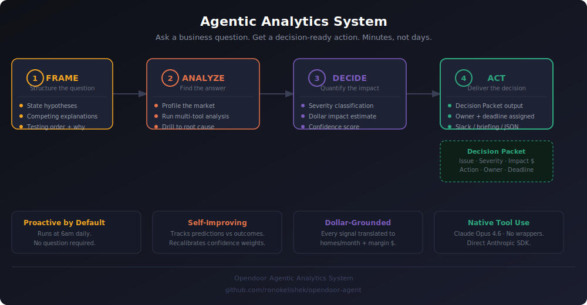

# Agentic Analytics System · Real Estate Decision Intelligence

> **A working example of what an AI Analytics Engineer actually builds: agents that detect problems, quantify the cost, and recommend action.**

Not a dashboard. Not a chatbot. A system that wakes up, scans every market, finds what's breaking, puts a dollar number on it, and tells the right person exactly what to do — before anyone asks.

**→ [See it live](https://ronokelishek.github.io/opendoor-agent/portfolio.html)**

---



---

## The Problem

Most analytics teams are reactive by design.

A market starts softening on Monday. The dashboard shows it by Wednesday. Someone notices on Thursday. A report goes out Friday. A decision gets made the following week — after 10 deals have already been mispriced, 15 seller conversations have gone sideways, and $180k in margin has quietly walked out the door.

The gap isn't data. It's the time between signal and action.

> When pricing drifts 3% above market, acceptance rate drops — but no one sees it for two weeks. By then, the damage is done.

---

## The Solution

This system runs a proactive intelligence loop. Every morning, without prompting, it:

1. Scans all active markets for pricing drift, inventory aging, and funnel deterioration
2. Scores each issue by severity and quantifies the dollar impact
3. Generates a Decision Packet — not an insight, an action plan with an owner and a deadline
4. Logs the prediction, tracks the outcome, and recalibrates its own confidence weights over time

It doesn't summarize data. It tells you what's broken, what it's costing, and what to do about it.

---

## Meet the Agents

### `monitor-agent` — Proactive Daily Intelligence

```
Trigger:   6am daily (EventBridge scheduler) or on-demand
Input:     None required
Output:    Decision Packets · Severity-ranked alerts · Slack / markdown briefing
```

The monitor agent runs without being asked. It scans every market through a structured sequence:

```
analyze_pricing_accuracy()     →  detect offer drift vs. market
    ↓ if HIGH severity
analyze_funnel_drop()          →  diagnose where conversion is breaking
generate_pricing_actions()     →  produce specific adjustments with deadlines
estimate_business_impact()     →  translate signal into homes/month and margin $

detect_inventory_surges()      →  flag markets where capital is aging
rank_top_100_deals()           →  surface the highest CM/day opportunities
get_contribution_margin_forecast()  →  portfolio-level margin outlook
```

Each issue that clears the severity threshold becomes a **Decision Packet** — structured, assigned, time-bound.

---

### `analytics-agent` — On-Demand Q&A

```
Trigger:   Natural language question from analyst or operator
Input:     Any market, deal, or risk question in plain English
Output:    Insight → Evidence → Recommended Action
```

Ask it anything. It decides which tools to call, in what order, how many times — and synthesizes the results into a structured answer that a VP can act on.

```
You:    What markets should I be worried about right now?

        [calling: detect_anomalies]
        [calling: rank_all_markets]

Agent:  Charlotte and Dallas are showing the same early-cycle warning pattern.
        DOM up 47% above average. Homes sold down 43% MoM.
        List-to-sale ratio approaching the 0.94 pause threshold.

        Action: Tighten acquisition spreads in Charlotte immediately.
                Reduce buy-box volume. If LSR < 0.94 next week — pause new offers.
```

---

## Example Outputs

### Daily Market Risk Briefing

```
MARKET INTELLIGENCE BRIEFING  ·  Monday 6:02am

PORTFOLIO SNAPSHOT
  Markets monitored:      4
  Active risk flags:      2  (1 HIGH · 1 MEDIUM)
  Avg hold days:         83  (target: 90)
  Portfolio CM:         $4.5M available across 100 ranked deals

─────────────────────────────────────────────────

SIGNAL 1  ·  PHOENIX  ·  HIGH
  Pricing drift detected: offers running +4.2% above market estimated value
  Acceptance rate declined 11.8% WoW · LSR: 0.94 (threshold: 0.95)
  DOM up 6 days MoM · Funnel bottleneck at offer stage

  Financial Impact:   ~10 homes/month at risk · $192k margin/month
  Action:             Narrow offer band -2% to -4% in affected ZIPs by Friday
  Owner:              Pricing Team
  Deadline:           72 hours

─────────────────────────────────────────────────

SIGNAL 2  ·  ATLANTA  ·  MEDIUM
  Inventory aging: 22% of active homes > 90 days DOM
  Holding cost exposure compounding at ~$230/day per property

  Action:             Accelerate price adjustments. Flag for weekly review.
  Owner:              Acquisitions Lead
```

---

### Decision Packet — Pricing Misalignment

```
DECISION PACKET
─────────────────────────────────────────────────
Issue:            Offer acceptance dropped 11.8% WoW in Phoenix
Severity:         HIGH — act within 24–72 hours

Evidence:
  · LSR at 0.94 (threshold: 0.95)
  · Offers drifting +4.2% above AVM-estimated market value
  · DOM increased 6 days MoM
  · Lead-to-offer ratio holding — problem is at the offer stage

Financial Impact:
  · ~10 homes/month not closing
  · $192,000 margin at risk per month
  · Annualized exposure: ~$2.3M if unaddressed

Action:
  1. Narrow offer band -2% to -4% in affected ZIPs by Friday
  2. Segment by property type — confirm pricing model inputs
  3. Monitor LSR weekly; re-evaluate if no recovery in 2 weeks

Expected Outcome: +6–9% acceptance rate recovery within 2–3 weeks
Owner:            Pricing Team
Confidence:       High (feedback-calibrated: 0.82)
─────────────────────────────────────────────────
```

---

### Capital-Light Deal Scoring

```
You:    Find me capital-light deals under $350k with ROI above 12%

        [calling: rank_top_100_deals(semantic_filter="capital-light opportunities")]

Agent:  27 deals meet the capital-light criteria.

        Top opportunity: Phoenix · 2,100 sqft · cosmetic condition
          Acquisition:   $298,000
          Renovation:    $31,000
          ARV:           $412,000
          CM:            $44,800  (10.9% of ARV)
          ROI:           13.6%
          Est. hold:     68 days
          CM/day:        $659

        This deal closes 22 days faster than the market average.
        At current capital cost, velocity is worth ~$5,000 in margin vs. a 90-day hold.
```

---

## What an AI Analytics Engineer Actually Builds

This is the difference between analytics that reports and analytics that acts.

### From reactive to proactive

| Traditional setup | This system |
|-------------------|-------------|
| Analyst pulls report when asked | Agent scans every morning, unprompted |
| Dashboard shows what happened | Agent interprets what it means and what to do |
| Signal noticed on Thursday | Decision Packet delivered Monday 6am |
| Recommendation written manually | Action assigned with owner, deadline, and SLA |
| Outcome not tracked | Prediction logged, outcome measured, confidence recalibrated |

### The business impact is concrete

Every signal the system surfaces gets translated into unit economics before it reaches a human:

```
Pricing drift +4%   →   10 homes/month not closing   →   $192k margin at risk
DOM up 6 days       →   holding cost compounding at $230/day per property
Inventory surge     →   capital deployed below CM floor of $30k/deal
```

A VP of Acquisitions doesn't have time to interpret signals. They need: **act on this by Friday or it costs $192k.** That's the output contract.

---

## System Capabilities

### Market Intelligence
- Multi-market anomaly detection with statistical threshold flagging
- 5-signal risk scoring (1–10) per market: DOM trend, sales volume, LSR, supply, price direction
- Historical trend analysis across 6 KPIs
- Leading indicator watch list for early-cycle warnings

### Pricing & Conversion
- List-to-Sale Ratio (LSR) as acceptance behavior proxy
- Stage-by-stage funnel diagnosis: where exactly conversion is breaking
- Offer band adjustment recommendations with ZIP-level specificity
- Business impact translation: homes/month and margin dollars per issue

### Deal Scoring & Capital Allocation
- 100 deals ranked by **Contribution Margin per day held** — the Capital-Light metric
- Full P&L per deal: `ARV − Acquisition − Renovation − Holding − Selling = CM`
- Semantic filters: `"capital-light opportunities"` · `"fast turn deals"` · `"high CM"`
- Renovation tier modeling: cosmetic / moderate / full gut, with ARV uplift estimates

### Operational Learning
- Every Decision Packet is logged with a predicted outcome
- Actual KPI measured on follow-up; prediction accuracy computed
- Confidence weights recalibrated automatically per issue type
- Weekly learning report surfaces model drift and accuracy trends

### Severity Framework

| Level | SLA | Default Response |
|-------|-----|-----------------|
| CRITICAL | 24 hours | Escalate to VP. Block new offers. |
| HIGH | 24–72 hours | Owner produces action plan by next business day |
| MEDIUM | 1 week | Flag for weekly review |
| LOW | Informational | Log and monitor |

---

## Architecture

```
Data Sources  →  Tool Layer  →  Claude Opus 4.6  →  Decision Outputs
```

**Data layer:** Market metrics, offer events, funnel activity, inventory status — currently CSV (production target: Snowflake via AWS Kinesis + Glue/dbt)

**Tool layer:** Six Python modules, each with a single responsibility. Tools return structured dicts — optimized for LLM reasoning, JSON-serializable, testable independently.

```
data_loader.py       get_market_summary · get_market_trend · detect_anomalies
analyzer.py          score_market_risk · rank_all_markets
deal_scout.py        get_top_deals · estimate_renovation
capital_light.py     detect_inventory_surges · CM forecast · rank_top_100_deals
pricing_engine.py    analyze_pricing_accuracy · analyze_funnel_drop
                     generate_pricing_actions · estimate_business_impact
feedback_tracker.py  log_recommendation · record_outcome · recalibrate_confidence
```

**Agent layer:** Claude decides which tools to call, in what sequence, how many times — based on what each tool returns. No orchestration framework. No prompt chaining. Just native tool use and a tight output contract.

**Output layer:** Decision Packets → terminal / Slack / markdown briefing / JSON pipeline

---

## Design Philosophy

**Default to proactive.** A system that waits to be asked will always be behind the market. The monitor agent runs on a schedule, not a prompt.

**Separate detection from decisioning.** Deterministic code finds the issue. Claude explains it, quantifies it, and recommends an action. Each layer does what it does best.

**Quantify impact, not just anomalies.** Flagging that LSR dropped is table stakes. Saying it costs $192k/month and naming the owner is what makes analytics operationally useful.

**Make actions explicit.** Every output includes who should act, by when, and what success looks like. No open-ended recommendations.

**Learn from outcomes.** The system tracks its own predictions, measures actual KPI recovery, and recalibrates confidence weights. It gets better over time without manual retraining.

---

## See It Live

**[→ Portfolio Overview](https://ronokelishek.github.io/opendoor-agent/portfolio.html)**
Full system walkthrough — Capital-Light strategy, deal scout, market risk

**[→ Decision Engine](https://ronokelishek.github.io/opendoor-agent/decision-engine.html)**
Pricing & Conversion alerts — Decision Packets, severity framework, feedback loop

**[→ Production Architecture](https://ronokelishek.github.io/opendoor-agent/production-architecture.html)**
AWS diagram — upstream systems, Snowflake tables, real-time data flow

---

## Quick Start

```bash
# 1. Clone
git clone https://github.com/ronokelishek/opendoor-agent.git
cd opendoor-agent
pip install -r requirements.txt

# 2. Configure
cp .env.example .env
# Add your ANTHROPIC_API_KEY to .env

# 3. Run the Q&A agent
py -m src.agent

# 4. Run the proactive daily briefing
py -m src.monitor

# 5. Run the Pricing Copilot (no API key needed)
py -m copilot.main --mock
```

---

## Tech Stack

| Category | Choice | Why |
|----------|--------|-----|
| LLM | Claude Opus 4.6 | Best multi-step reasoning + native tool use |
| Agent Framework | Anthropic Python SDK | No wrappers — direct API, full control |
| Data | pandas | Production-proven, fast to iterate |
| Data Warehouse | Snowflake *(Phase 2)* | Standard at scale for this domain |
| Ingestion | AWS Kinesis + S3 + Glue | Real-time offers + batch market data |
| Scheduling | AWS EventBridge | 6am daily briefing cron |
| Language | Python 3.14 | |

---

## Project Structure

```
opendoor-agent/
├── src/
│   ├── agent.py                  ← Q&A agent — natural language to tool calls to action
│   ├── monitor.py                ← Proactive daily briefing — no input required
│   └── tools/
│       ├── data_loader.py        ← Market metrics: summary, trend, anomaly detection
│       ├── analyzer.py           ← Risk scoring engine (1–10 per market)
│       ├── deal_scout.py         ← Deal ranking: ROI, P&L, renovation estimates
│       ├── capital_light.py      ← CM forecast, inventory surges, semantic deal filters
│       ├── pricing_engine.py     ← Decision Engine: LSR, funnel, actions, impact $
│       └── feedback_tracker.py   ← Prediction logging, outcome tracking, recalibration
├── copilot/                      ← Standalone pricing pipeline (mock mode, no API key)
│   ├── data/                     ← Reproducible synthetic data (seed=42)
│   ├── detection/                ← Deterministic issue detection
│   ├── agents/                   ← Claude reasoning layer with mock fallback
│   └── reports/                  ← Markdown reports, JSON alerts, Slack summaries
├── agents/
│   ├── analytics-agent.yml       ← Agent role, tools, output format
│   └── monitor-agent.yml         ← Monitor agent definition
├── skills/
│   ├── market-briefing/          ← Daily intelligence skill
│   ├── risk-analyzer/            ← 5-signal acquisition risk scoring
│   └── deal-scout/               ← ROI deal ranking skill
├── briefings/                    ← Auto-saved daily reports (markdown)
└── docs/
    ├── portfolio.html            ← Portfolio showcase
    ├── decision-engine.html      ← Decision Engine showcase
    ├── production-architecture.html ← AWS production architecture
    └── architecture.md           ← Full system documentation
```

---

## What This Demonstrates

An AI Analytics Engineer doesn't just analyze data — they build the system that turns data into decisions.

This project shows that full stack:

- **Detection** — finding the signal before it becomes a problem
- **Quantification** — putting a dollar number on every risk, not just a flag
- **Action** — recommending exactly what to do, who owns it, and by when
- **Learning** — tracking whether the recommendation was right, and getting better

The architecture is intentional at every layer: deterministic detection, LLM reasoning, structured outputs, outcome feedback. Nothing is bolted on. Each piece earns its place.

> This is what I build. If your team needs analytics that acts, not just reports — [let's talk](https://github.com/ronokelishek).
